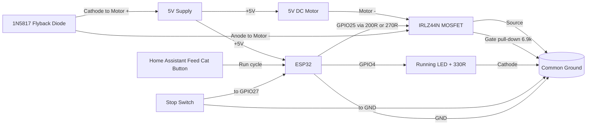

# ESP32 + 5V Motor Control (IRLZ44N + 1N5817 + Stop Switch + Running LED)

This guide shows how to control a 5V DC motor from an ESP32 using:

- IRLZ44N (logic-level N-channel MOSFET) as a low-side switch
- 1N5817 (Schottky diode) as flyback protection
- A stop switch to signal when the motor should stop
- A running LED that is ON only while the motor is running

## ESP Home 

[esp 32 configuration](./cat-feeder.yaml)

## 1) What this design does

- Home Assistant exposes a `Feed Cat` button (not a raw motor switch).
- Pressing the button starts the motor only if the stop switch is not already active.
- The motor runs until the stop switch is pressed, then turns off immediately.
- A running LED follows motor state (ON while motor is ON, OFF when motor is OFF).
- Motor current flows through the MOSFET to ground.
- When motor turns off, the flyback diode clamps voltage spikes.
- The stop switch input always forces motor OFF when pressed.

## 2) Wiring instructions

Use a 5V supply sized for both the motor and ESP32 load.
Always connect grounds together.

### Power and motor path

1. 5V supply `+` -> Motor `+` terminal.
2. 5V supply `+` -> ESP32 `5V`/`VIN` pin.
3. Motor `-` terminal -> IRLZ44N `Drain`.
4. IRLZ44N `Source` -> Ground.
5. ESP32 `GND` -> Same Ground (common ground with motor PSU).

### Flyback diode (1N5817)

Place the diode physically near the motor terminals:

- Diode `cathode` (striped end) -> Motor `+` (5V side)
- Diode `anode` -> Motor `-` (MOSFET drain side)

This keeps the diode reverse-biased during normal operation and active only on turn-off spikes.

### MOSFET pinout (3 pins) and simple schematic

For the IRLZ44N in TO-220 package, hold it with the flat face (text side) toward you and legs pointing down:

~~~text
Front view (flat/text side facing you)

   IRLZ44N
  _________
 |         |
 |_________|
   |  |  |
   1  2  3
   G  D  S

Pin 1 = Gate
Pin 2 = Drain
Pin 3 = Source
Metal tab = Drain (same node as Pin 2)
~~~

Simple connection map:

~~~text
ESP32 GPIO25 ---200R or 270R--- Pin 1 (G)
                     |
                  6.9k to GND

Motor - ---------------- Pin 2 (D)

Pin 3 (S) ------------- GND (common with ESP32 GND and PSU GND)
~~~

### MOSFET gate drive

1. ESP32 GPIO (example: GPIO25) -> `200 or 270 ohm` resistor -> IRLZ44N `Gate`.
2. IRLZ44N `Gate` -> `6.9k ohm` resistor -> Ground (pull-down).

The pull-down keeps the motor off during boot/reset.

### Stop switch input

Wire switch as active-low with ESP32 internal pull-up:

1. One switch side -> ESP32 GPIO (example: GPIO27).
2. Other switch side -> Ground.
3. Configure GPIO27 as `INPUT_PULLUP` in software.

When pressed/closed, input reads LOW and motor is stopped.

### Running LED output

Wire a simple status LED to indicate motor state:

1. ESP32 GPIO4 -> `330 ohm` resistor -> LED `anode` (+).
2. LED `cathode` (-) -> Ground.
3. In ESPHome, this LED is tied to motor on/off events.

- GPIO25: brown
- VCC: Blue
- Gnd: Purple
- GPIO27: white

## 3) 9-rail prototyping board layout

For a prototyping board with 9 long rails, use this rail assignment from top to bottom:

| Rail | Purpose | Main connections |
|---|---|---|
| 1 | +5V main bus | PSU +, ESP32 VIN/5V, Motor +, flyback diode cathode, 470 uF + 0.1 uF cap positive |
| 2 | GND main bus | PSU -, ESP32 GND, stop switch return, LED return, capacitor negative |
| 3 | MOSFET gate network | GPIO25 (through 200R/270R), MOSFET Pin 1 Gate, 6.9k pull-down start |
| 4 | Motor - / MOSFET drain | Motor -, MOSFET Pin 2 Drain, flyback diode anode |
| 5 | MOSFET source local ground | MOSFET Pin 3 Source, 6.9k pull-down end, short thick bridge to Rail 2 |
| 6 | ESP32 signal breakout | GPIO25, GPIO27, GPIO4 fan-out point |
| 7 | Stop switch signal | GPIO27 line to switch |
| 8 | Running LED signal | GPIO4 line to 330R + LED path |
| 9 | Decoupling / spare | Spare rail for future additions |

Suggested physical placement:

1. Left side: PSU input and decoupling capacitors (470 uF electrolytic plus 0.1 uF ceramic) across Rails 1 and 2.
2. Mid-left: motor connector on Rail 1 (`Motor +`) and Rail 4 (`Motor -`); place flyback diode directly at motor pins.
3. Mid: IRLZ44N centered on Rails 3, 4, and 5 so pins 1-2-3 land on consecutive rails.
4. Right side: ESP32 and all low-current signal parts (switch and LED).

Keep motor-current wiring short and away from GPIO/switch wiring where possible.
Bridge Rail 5 to Rail 2 with a short, thick jumper to tie MOSFET source into the main ground bus.

### IRLZ44N pin details for Section 3 rail layout

With the IRLZ44N front face (text side) toward you and legs pointing down:

1. Pin 1 (`Gate`) -> Rail 3 (`MOSFET gate network`).
2. Pin 2 (`Drain`) -> Rail 4 (`Motor - / MOSFET drain node`).
3. Pin 3 (`Source`) -> Rail 5 (`MOSFET source local ground rail`), then short bridge from Rail 5 to Rail 2.
4. Metal tab -> same as Pin 2 (`Drain`), so keep the tab away from ground rails and metal hardware unless intentionally insulated.

Section 3 connection checklist for the MOSFET:

1. GPIO25 (from Rail 6) -> 200R/270R -> Rail 3 -> Pin 1 (Gate).
2. 6.9k pull-down from Rail 3 to Rail 5.
3. Motor negative lead on Rail 4 -> Pin 2 (Drain).
4. Pin 3 (Source) to Rail 5, then Rail 5 -> Rail 2 with a short, thick jumper.

### Rail-to-rail connection table

| From | To | Purpose |
|---|---|---|
| Rail 1 | Rail 1 nodes (Motor +, ESP32 VIN, diode cathode, cap +) | Shared +5V distribution |
| Rail 4 | MOSFET Pin 2 (Drain) and Motor - | Switched motor return path |
| Rail 3 | MOSFET Pin 1 (Gate) | Gate drive path |
| Rail 3 | Rail 5 (through 6.9k) | Gate pull-down reference |
| Rail 5 | MOSFET Pin 3 (Source) | Source local ground point |
| Rail 5 | Rail 2 (short thick bridge) | Low-impedance return to main ground |
| Rail 6 | Rail 3 (through 200R/270R) | GPIO25 gate control |
| Rail 6 | Rail 7 | GPIO27 stop switch signal |
| Rail 6 | Rail 8 | GPIO4 running LED signal |
| Rail 1 | Rail 2 (through 470 uF + 0.1 uF) | Supply decoupling |

In this layout, `Motor +` and ESP32 `VIN/5V` are both connected directly to Rail 1.
The MOSFET pins are placed on consecutive rails: Rail 3 (Gate), Rail 4 (Drain), Rail 5 (Source).

## 4) Mermaid wiring diagram

## 7) Important limits and checks

- Confirm motor stall current is within IRLZ44N thermal limits.
- Keep motor wiring short and thicker than signal wiring.
- Add a bulk capacitor near motor supply (for example, 220 uF to 470 uF).
- Add a 0.1 uF ceramic across 5V and GND near ESP32 power pins (this is the same as 100 nF).
- Keep the Rail 5 to Rail 2 source-ground bridge short and low resistance.
- If switch wiring is long/noisy, add debounce in ESPHome filters.

## 8) Quick test plan

1. Verify motor stays OFF at ESP32 boot (pull-down working).
2. Press `Feed Cat`; motor should start and running LED should turn ON.
3. Trigger stop switch; motor should turn OFF immediately and LED should turn OFF.
4. Press `Feed Cat` while stop switch is already active; motor should not start.
5. Repeat several times and check MOSFET temperature.
