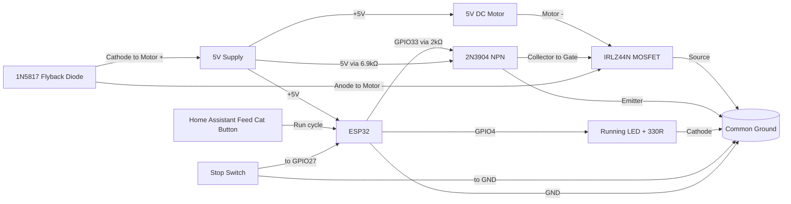

# ESP32 + 5V Motor Control (IRLZ44N + 1N5817 + 2N3904 + Stop Switch + Running LED)

This guide shows how to control a 5V DC motor from an ESP32 using:

- IRLZ44N (logic-level N-channel MOSFET) as a low-side switch
- 1N5817 (Schottky diode) as flyback protection
- 2N3904 NPN transistor as 3.3V to 5V gate level shifter
- A stop switch to signal when the motor should stop
- A running LED that is ON only while the motor is running

## ESP Home 

[esp 32 configuration](./cat-feeder.yaml)

## 1) What this design does

- Home Assistant exposes a `Feed Cat` button (not a raw motor switch).
- Pressing the button starts the motor only if the stop switch is not already active.
- The motor runs until the stop switch is pressed, then turns off immediately.
- A running LED follows motor state (ON while motor is ON, OFF when motor is OFF).
- Motor current flows through the MOSFET to ground.
- When motor turns off, the flyback diode clamps voltage spikes.
- The stop switch input always forces motor OFF when pressed.

## 2) Wiring instructions

Use a 5V supply sized for both the motor and ESP32 load.
Always connect grounds together.

### Power and motor path

1. 5V supply `+` -> Motor `+` terminal.
2. 5V supply `+` -> ESP32 `5V`/`VIN` pin.
3. Motor `-` terminal -> IRLZ44N `Drain`.
4. IRLZ44N `Source` -> Ground.
5. ESP32 `GND` -> Same Ground (common ground with motor PSU).

### Flyback diode (1N5817)

Place the diode physically near the motor terminals:

- Diode `cathode` (striped end) -> Motor `+` (5V side)
- Diode `anode` -> Motor `-` (MOSFET drain side)

This keeps the diode reverse-biased during normal operation and active only on turn-off spikes.

### MOSFET pinout (3 pins) and simple schematic

For the IRLZ44N in TO-220 package, hold it with the flat face (text side) toward you and legs pointing down:

~~~text
Front view (flat/text side facing you)

   IRLZ44N
  _________
 |         |
 |_________|
   |  |  |
   1  2  3
   G  D  S

Pin 1 = Gate
Pin 2 = Drain
Pin 3 = Source
Metal tab = Drain (same node as Pin 2)
~~~

Simple connection map (with 2N3904 level shifter):

~~~text
ESP32 GPIO33 ---2kΩ--- 2N3904 Base (Pin 2)
                       2N3904 Emitter (Pin 1) --- GND

5V ---6.9kΩ--- 2N3904 Collector (Pin 3) --- Pin 1 (G) IRLZ44N

Motor - ----------------------------------- Pin 2 (D)

Pin 3 (S) --------------------------------- GND (common with ESP32 GND and PSU GND)
~~~

Logic is inverted: GPIO33 HIGH → 2N3904 ON → Gate pulled LOW → motor OFF.
ESPHome compensates with `inverted: true` on the motor output pin.

### MOSFET gate drive (via 2N3904 level shifter)

The ESP32 outputs 3.3V which is insufficient to fully turn on the IRLZ44N. A 2N3904 NPN transistor converts the 3.3V signal to a 5V gate drive.

#### 2N3904 pinout (TO-92 package)

Hold it with the flat/text side facing you and legs pointing down:

~~~text
Front view (flat/text side facing you)

  2N3904
  _____
 /     \
|_______|
  |  |  |
  1  2  3
  E  B  C

Pin 1 = Emitter
Pin 2 = Base
Pin 3 = Collector
~~~

#### 2N3904 wiring

1. ESP32 GPIO33 -> `2k ohm` resistor -> 2N3904 `Base` (Pin 2).
2. 2N3904 `Emitter` (Pin 1) -> Ground.
3. 5V -> `6.9k ohm` resistor -> 2N3904 `Collector` (Pin 3).
4. 2N3904 `Collector` (Pin 3) -> IRLZ44N `Gate` (Pin 1).

> **No gate pull-down needed.** When the 2N3904 is ON it pulls the gate to near 0V directly. A pull-down would fight the pull-up and reduce gate voltage below the IRLZ44N threshold.

> **Inverted logic:** When GPIO33 is HIGH the 2N3904 turns on and pulls the gate LOW (motor OFF). ESPHome compensates with `inverted: true` on the motor output pin so Home Assistant logic remains unchanged.

### Stop switch input

Wire switch as active-low with ESP32 internal pull-up:

1. One switch side -> ESP32 GPIO (example: GPIO27).
2. Other switch side -> Ground.
3. Configure GPIO27 as `INPUT_PULLUP` in software.

When pressed/closed, input reads LOW and motor is stopped.

### Running LED output

Wire a simple status LED to indicate motor state:

1. ESP32 GPIO4 -> `330 ohm` resistor -> LED `anode` (+).
2. LED `cathode` (-) -> Ground.
3. In ESPHome, this LED is tied to motor on/off events.

- GPIO33: brown
- VCC: Blue
- Gnd: Purple
- GPIO27: white

## 3) 9-rail prototyping board layout

For a prototyping board with 9 long rails, use this rail assignment from top to bottom:

| Rail | Purpose | Main connections |
|---|---|---|
| 1 | +5V main bus | PSU +, ESP32 VIN/5V, Motor +, flyback diode cathode, 6.9kΩ pull-up (to Rail 3), 470 uF + 0.1 uF cap positive |
| 2 | GND main bus | PSU -, ESP32 GND, stop switch return, LED return, capacitor negative |
| 3 | MOSFET gate / 2N3904 collector | 2N3904 Collector (Rail 9 bridge), MOSFET Pin 1 Gate, 6.9kΩ pull-up other end (from Rail 1) |
| 4 | Motor - / MOSFET drain | Motor -, MOSFET Pin 2 Drain, flyback diode anode |
| 5 | MOSFET source local ground | MOSFET Pin 3 Source, short thick bridge to Rail 2, 2N3904 Pin 1 (E) |
| 6 | 2N3904 Base | 2N3904 Pin 2 (B), 2kΩ resistor to Rail 6 (GPIO33) |
| 7 | 2N3904 Collector | 2N3904 Pin 3 (C), short bridge to Rail 3 (Gate drive) |

Keep motor-current wiring short and away from GPIO/switch wiring where possible.
Bridge Rail 5 to Rail 2 with a short, thick jumper to tie MOSFET source into the main ground bus.
The 2N3904 sits on Rails 7, 8, 9. Bridge Rail 7 to Rail 2 (Emitter→GND) and Rail 9 to Rail 3 (Collector→Gate) with short jumpers.
The 6.9kΩ pull-up resistor bridges Rail 1 (+5V) directly to Rail 3; insert it straight across those two rails.

### 2N3904 pin details for Section 3 rail layout

The TO-92 pin pitch is 1.27mm (half of 2.54mm), so with a small preparation step the 2N3904 can be made to span exactly 3 consecutive rails at 2.54mm pitch.

**Preparation — bend the outer pins:**
Hold the 2N3904 body with flat side facing you. Gently bend Pin 1 (E) outward to the left and Pin 3 (C) outward to the right until all three pins are evenly spaced at 2.54mm. The middle pin (B) stays straight.

With the 2N3904 flat/text side facing you and legs pointing down (after bending):

~~~text
Front view after bending

    2N3904
    _____
   /     \
  |_______|
 /    |    \
1     2     3
E     B     C

Pin 1 (E) → Rail 5
Pin 2 (B) → Rail 6
Pin 3 (C) → Rail 7
~~~

| Pin | Name | Rail | Onward connection |
|---|---|---|---|
| 1 | Emitter | Rail 7 | Short jumper from Rail 7 to Rail 2 (GND) |
| 2 | Base | Rail 8 | 2kΩ resistor from Rail 8 to Rail 6 (GPIO33) |
| 3 | Collector | Rail 9 | Short jumper from Rail 9 to Rail 3 (Gate/pull-up node) |

**6.9kΩ pull-up resistor:** Insert it directly across Rail 1 (+5V) and Rail 3 (Gate node). One leg in Rail 1, other leg in Rail 3 — no jumper wire needed, the resistor body bridges the gap.

The IRLZ44N Gate (Pin 1) also sits on Rail 3, so Rail 3 is the common node for the 2N3904 Collector, the 6.9kΩ pull-up, and the IRLZ44N Gate. There is no pull-down resistor — the 2N3904 handles pulling the gate low when the motor should be OFF.

### IRLZ44N pin details for Section 3 rail layout

With the IRLZ44N front face (text side) toward you and legs pointing down:

1. Pin 1 (`Gate`) -> Rail 3 (`MOSFET gate / 2N3904 collector`).
2. Pin 2 (`Drain`) -> Rail 4 (`Motor - / MOSFET drain node`).
3. Pin 3 (`Source`) -> Rail 5 (`MOSFET source local ground rail`), then short bridge from Rail 5 to Rail 2.
4. Metal tab -> same as Pin 2 (`Drain`), so keep the tab away from ground rails and metal hardware unless intentionally insulated.

Section 3 connection checklist for the MOSFET:

1. GPIO33 (from Rail 6) -> 2kΩ -> 2N3904 Base (Pin 2).
2. 2N3904 Emitter (Pin 1) -> Rail 2 (GND).
3. 5V (Rail 1) -> 6.9kΩ -> 2N3904 Collector (Pin 3) -> Rail 3.
4. Rail 3 -> Pin 1 (Gate) of IRLZ44N.
5. Motor negative lead on Rail 4 -> Pin 2 (Drain).
6. Pin 3 (Source) to Rail 5, then Rail 5 -> Rail 2 with a short, thick jumper.

### Rail-to-rail connection table

| From | To | Purpose |
|---|---|---|
| Rail 1 | Rail 1 nodes (Motor +, ESP32 VIN, diode cathode, cap +) | Shared +5V distribution |
| Rail 4 | MOSFET Pin 2 (Drain) and Motor - | Switched motor return path |
| Rail 3 | MOSFET Pin 1 (Gate) | Gate drive path |
| Rail 5 | MOSFET Pin 3 (Source) | Source local ground point |
| Rail 5 | Rail 2 (short thick bridge) | Low-impedance return to main ground |
| Rail 6 | Rail 8 (through 2kΩ) | GPIO33 → 2N3904 Base |
| Rail 8 | 2N3904 Pin 2 Base | Base drive |
| Rail 7 | 2N3904 Pin 1 Emitter | Emitter local node |
| Rail 7 | Rail 2 (short jumper) | Emitter to GND |
| Rail 9 | 2N3904 Pin 3 Collector | Collector local node |
| Rail 9 | Rail 3 (short jumper) | Collector to Gate drive node |
| Rail 1 | Rail 3 (through 6.9kΩ) | 5V pull-up for Gate/Collector node |
| Rail 1 | Rail 2 (through 470 uF + 0.1 uF) | Supply decoupling |

In this layout, `Motor +` and ESP32 `VIN/5V` are both connected directly to Rail 1.
The MOSFET pins are placed on consecutive rails: Rail 3 (Gate), Rail 4 (Drain), Rail 5 (Source).

## 4) Mermaid wiring diagram

## 7) Important limits and checks

- Confirm motor stall current is within IRLZ44N thermal limits.
- Keep motor wiring short and thicker than signal wiring.
- Add a bulk capacitor near motor supply (for example, 220 uF to 470 uF).
- Add a 0.1 uF ceramic across 5V and GND near ESP32 power pins (this is the same as 100 nF).
- Keep the Rail 5 to Rail 2 source-ground bridge short and low resistance.
- If switch wiring is long/noisy, add debounce in ESPHome filters.

## 8) Quick test plan

1. Verify motor stays OFF at ESP32 boot (pull-down working).
2. Press `Feed Cat`; motor should start and running LED should turn ON.
3. Trigger stop switch; motor should turn OFF immediately and LED should turn OFF.
4. Press `Feed Cat` while stop switch is already active; motor should not start.
5. Repeat several times and check MOSFET temperature.
