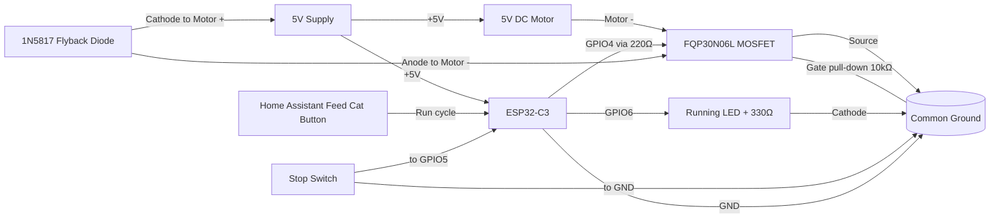

# ESP32-C3 + 5V Motor Control (FQP30N06L + 1N5817 + Stop Switch + Running LED)

This guide shows how to control a 5V DC motor from an ESP32-C3 using:

- FQP30N06L (logic-level N-channel MOSFET) as a low-side switch, driven directly from 3.3V GPIO
- 1N5817 (Schottky diode) as flyback protection
- A stop switch to signal when the motor should stop
- A running LED that is ON only while the motor is running

## ESPHome

[ESP32-C3 configuration](./cat-feeder.yaml)

## 1) What this design does

- Home Assistant exposes a `Feed Cat` button (not a raw motor switch).
- Pressing the button starts the motor only if the stop switch is not already active.
- The motor runs until the stop switch is pressed, then turns off immediately.
- A running LED follows motor state (ON while motor is ON, OFF when motor is OFF).
- Motor current flows through the MOSFET to ground.
- When motor turns off, the flyback diode clamps voltage spikes.
- The stop switch input always forces motor OFF when pressed.

## 2) Why FQP30N06L — no level shifter needed

The FQP30N06L is a logic-level MOSFET with a gate threshold voltage of 1.0–2.5V. At 3.3V Vgs it is well into enhancement for the low currents a small 5V motor draws. This eliminates any NPN level-shifter circuit that would be required with a standard MOSFET like the IRLZ44N.

Key specs:
- Vds: 60V
- Id (continuous): 32A
- Rds(on): 35mΩ @ Vgs = 10V (much lower at 3.3V than needed for a small motor)
- Vgs(th): 1.0–2.5V
- Package: TO-220

**Direct drive from ESP32-C3 GPIO — no inverting logic, no pull-up resistor, no transistor.**

## 3) Wiring instructions

Use a 5V supply sized for both the motor and ESP32-C3 load.
Always connect grounds together.

### Power and motor path

1. 5V supply `+` → Motor `+` terminal.
2. 5V supply `+` → ESP32-C3 `5V`/`VIN` pin.
3. Motor `-` terminal → FQP30N06L `Drain`.
4. FQP30N06L `Source` → Ground.
5. ESP32-C3 `GND` → Same Ground (common ground with motor PSU).

### Flyback diode (1N5817)

Place the diode physically near the motor terminals:

- Diode `cathode` (striped end) → Motor `+` (5V side)
- Diode `anode` → Motor `-` (MOSFET drain side)

This keeps the diode reverse-biased during normal operation and active only on turn-off spikes.

### MOSFET pinout (TO-220 package)

Hold the FQP30N06L with the flat face (text side) toward you and legs pointing down:

~~~text
Front view (flat/text side facing you)

   FQP30N06L
  _________
 |         |
 |_________|
   |  |  |
   1  2  3
   G  D  S

Pin 1 = Gate
Pin 2 = Drain
Pin 3 = Source
Metal tab = Drain (same node as Pin 2)
~~~

### Gate drive (direct from ESP32-C3)

~~~text
ESP32-C3 GPIO4 ---[220Ω]--- FQP30N06L Pin 1 (Gate)
                                  |
                               [10kΩ]
                                  |
                                 GND
~~~

- **220Ω series resistor**: Limits inrush current into gate capacitance (~1nF). Optional but good practice.
- **10kΩ pull-down resistor**: Keeps gate LOW (motor OFF) during ESP32-C3 boot when GPIO is floating.
- **Logic is non-inverted**: GPIO4 HIGH → gate HIGH → motor ON. No `inverted: true` needed in ESPHome.

### Stop switch input

Wire switch as active-low with ESP32-C3 internal pull-up:

1. One switch side → ESP32-C3 GPIO5.
2. Other switch side → Ground.
3. Configure GPIO5 as `INPUT_PULLUP` in software.

When pressed/closed, input reads LOW and motor is stopped.

### Running LED output

Wire a simple status LED to indicate motor state:

1. ESP32-C3 GPIO6 → `330Ω` resistor → LED `anode` (+).
2. LED `cathode` (-) → Ground.
3. In ESPHome, this LED is tied to motor on/off events.

### Wire color reference

- GPIO4 (motor): brown
- VCC: blue
- GND: purple
- GPIO5 (stop switch): white
- GPIO6 (LED): green

## 4) 9-rail prototyping board layout

With the 2N3904 level shifter eliminated, the layout is much simpler. Only 6 rails are actively used.

| Rail | Purpose | Main connections |
|---|---|---|
| 1 | +5V main bus (blue) | PSU +, ESP32-C3 VIN/5V, Motor +, 1N5817 cathode (circle), 470µF cap +, 0.1µF cap + |
| 2 | GND main bus (purple, yellow) | PSU -, ESP32-C3 GND, stop switch return, LED cathode, 470µF cap -, 0.1µF cap -, 10kΩ pull-down leg |
| 3 | MOSFET Gate node | FQP30N06L Pin 1 (Gate), 220Ω resistor (from Rail 6), 10kΩ resistor (to Rail 2) |
| 4 | Motor - / MOSFET Drain (green) | Motor -, FQP30N06L Pin 2 (Drain), 1N5817 anode |
| 5 | MOSFET Source (local GND) | FQP30N06L Pin 3 (Source), short thick bridge to Rail 2 |
| 6 | GPIO4 landing | GPIO4 wire, 220Ω resistor (to Rail 3) |
| 7–9 | Unused | Available for future expansion |

### FQP30N06L pin placement

With the FQP30N06L front face (text side) toward you and legs pointing down, the three pins land on consecutive rails:

1. Pin 1 (`Gate`) → Rail 3
2. Pin 2 (`Drain`) → Rail 4
3. Pin 3 (`Source`) → Rail 5

Metal tab is Drain — keep it away from ground rails unless intentionally insulated.

### Component placement on rails

Every component below is listed with the exact rail each leg connects to.

| Component | Leg 1 (rail) | Leg 2 (rail) | Notes |
|---|---|---|---|
| FQP30N06L | Pin 1 Gate → Rail 3 | Pin 2 Drain → Rail 4, Pin 3 Source → Rail 5 | MOSFET spans Rails 3–4–5 |
| 220Ω resistor | Rail 6 | Rail 3 | Series gate resistor; bridges GPIO4 landing to Gate node |
| 10kΩ resistor | Rail 3 | Rail 2 | Gate pull-down; bridges Gate node to GND bus |
| 1N5817 diode | Anode → Rail 4 | Cathode → Rail 1 | Flyback protection; bridges Drain to +5V |
| 470µF electrolytic cap | + leg → Rail 1 | - leg → Rail 2 | Bulk supply decoupling; observe polarity |
| 0.1µF ceramic cap | Leg 1 → Rail 1 | Leg 2 → Rail 2 | HF supply decoupling; no polarity |
| Bridge wire (thick) | Rail 5 | Rail 2 | Ties MOSFET Source to main GND; keep short |
| Motor - wire | Rail 4 | — | Switched motor return |
| Motor + wire | Rail 1 | — | Motor power from +5V bus |
| GPIO4 wire | Rail 6 | — | ESP32-C3 gate drive signal |
| Stop switch wire | GPIO5 | Rail 2 (GND) | Active-low with internal pull-up |
| LED + 330Ω | GPIO6 → 330Ω → LED anode | LED cathode → Rail 2 | Running indicator |

### Rail-to-rail connection table

| From | To | Via | Purpose |
|---|---|---|---|
| Rail 6 | Rail 3 | 220Ω resistor | GPIO4 gate drive to Gate node |
| Rail 3 | Rail 2 | 10kΩ resistor | Gate pull-down to GND |
| Rail 4 | Rail 1 | 1N5817 diode (anode→cathode) | Flyback clamp |
| Rail 5 | Rail 2 | Short thick bridge wire | MOSFET Source to main GND |
| Rail 1 | Rail 2 | 470µF electrolytic cap | Bulk supply decoupling |
| Rail 1 | Rail 2 | 0.1µF ceramic cap | HF supply decoupling |

## 5) Mermaid wiring diagram

## 6) ESPHome notes

With the FQP30N06L direct-drive design, the motor output pin configuration simplifies:

- GPIO4 output: **no `inverted: true`** — HIGH means motor ON, LOW means motor OFF.
- The 10kΩ pull-down ensures the motor stays OFF during boot regardless of ESP32-C3 GPIO state.

| Wire | Pin |
| ---- | --- |
| Purple | G |
| Blue   | 5v |
| Brown  | GPIO4 |
| White  | GPIO5 |
| Grey   | GPIO6 |

## 7) Important limits and checks

- Confirm motor stall current is within FQP30N06L thermal limits (32A continuous, 79W max dissipation — far beyond any small 5V motor).
- At 3.3V Vgs the Rds(on) will be higher than the 35mΩ spec (which is at 10V), but for a motor drawing under 1–2A this adds negligible voltage drop and heat.
- Keep motor wiring short and thicker than signal wiring.
- Add a bulk capacitor near motor supply (470µF electrolytic).
- Add a 0.1µF ceramic across 5V and GND near ESP32-C3 power pins.
- Keep the Rail 5 to Rail 2 source-ground bridge short and low resistance.
- If switch wiring is long/noisy, add debounce in ESPHome filters.

## 8) Quick test plan

1. Verify motor stays OFF at ESP32-C3 boot (10kΩ pull-down working).
2. Press `Feed Cat`; motor should start and running LED should turn ON.
3. Trigger stop switch; motor should turn OFF immediately and LED should turn OFF.
4. Press `Feed Cat` while stop switch is already active; motor should not start.
5. Repeat several times and check MOSFET temperature (should stay cool with a small motor).

